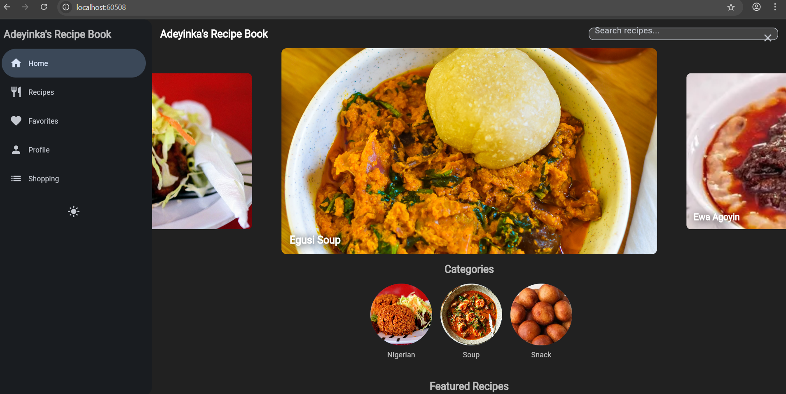
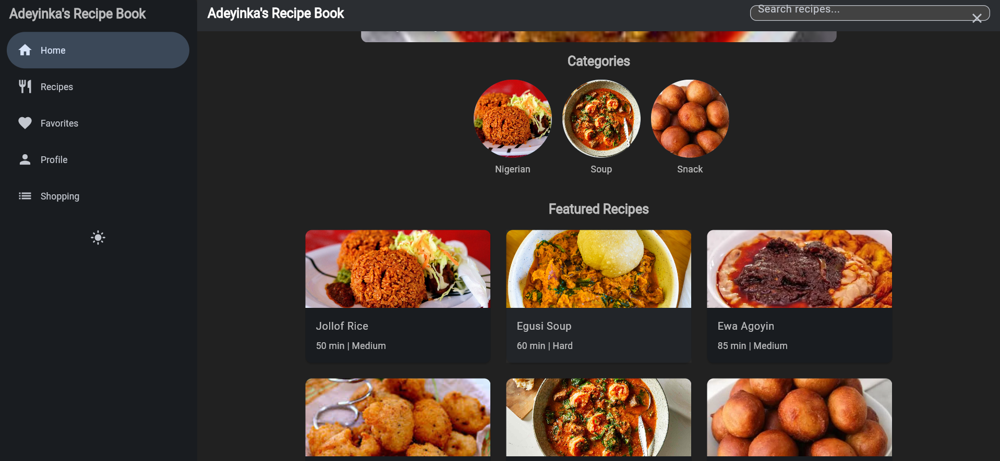
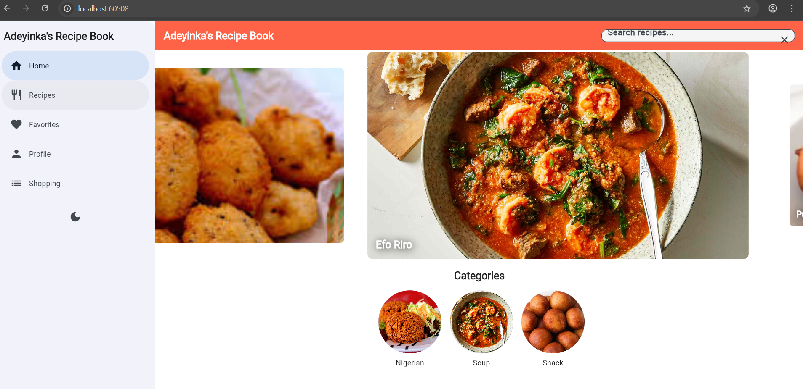
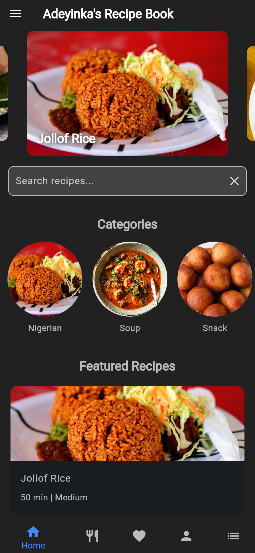
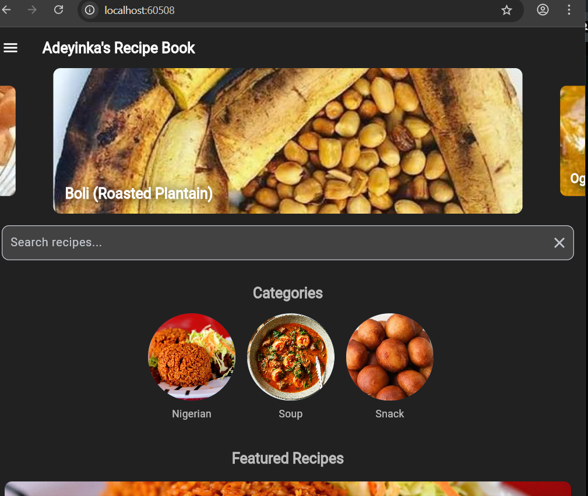

# Recipe Book App 🍽️

Welcome to Adeyinka's **Recipe Book App**, a delightful Flutter-based mobile app designed to make your culinary adventures fun and easy! Whether you're a seasoned chef or just starting out, this app helps you explore, save, and organize recipes with a user-friendly interface that looks great on any device. Built with love and a sprinkle of creativity, this app is perfect for foodies who want to discover new dishes, manage favorites, and keep a handy shopping list.

## 📋 App Description and Features

The Recipe Book App is your go-to companion for all things food. It’s built with Flutter to ensure a smooth, cross-platform experience on Android, iOS, and even desktop or web (with some tweaks). Here’s what makes it special:

- **Explore Recipes**: Browse a curated list of recipes with a search feature to find dishes by name or category (e.g., Nigerian, Soup, Snacks).
- **Responsive Design**: Enjoy a seamless experience on mobile, tablet, and desktop:
  - **Mobile**: A red `BottomNavigationBar` for easy navigation, with a drawer for additional options like theme toggling.
  - **Tablet**: A `NavigationRail` for a sleek, side-by-side navigation experience.
  - **Desktop**: A `NavigationDrawer` for a polished, spacious layout.
- **Favorites**: Save your favorite recipes with a single tap, stored locally using `SharedPreferences`.
- **Shopping List**: Add recipe ingredients to a shopping list, with automatic quantity aggregation for convenience.
- **Theme Toggle**: Switch between light and dark themes, with preferences saved so your app always looks the way you like it.
- **Recipe Details**: View detailed recipe info, including adjustable serving sizes, ingredients, instructions, and nutrition facts.
- **Helper Utilities**: Format durations (e.g., "1 hr 30 min"), capitalize strings, and validate search queries for a polished user experience.

## 📸 App Screenshots

### 🏠 Home Screen






### 📋 Recipe Detail


## 🚀 How to Run the Project

Getting the Recipe Book App up and running is a breeze! Follow these steps to dive into the code and start exploring recipes.

### Prerequisites

- **Flutter SDK**: Version 3.24.0 or later. Install it from flutter.dev.
- **Dart**: Comes bundled with Flutter.
- **Android Studio** or **VS Code**: For running the app and managing emulators.
- **Android/iOS Emulator** or **Physical Device**: For testing. I used the `sdk gphone64 x86 64` emulator during development.
- **Git**: To clone the repository.

### Setup Steps

1. **Clone the Repository**:

   ```bash
   git clone https://github.com/your-username/recipe-book-app.git
   cd recipe-book-app
   ```

2. **Install Dependencies**: Ensure your `pubspec.yaml` includes the following dependencies:

   ```yaml
   dependencies:
     flutter:
       sdk: flutter
     shared_preferences: ^2.3.0
     carousel_slider: ^5.1.1
     flutter_staggered_grid_view: ^0.7.0
     intl: ^0.20.2
     cupertino_icons: ^1.0.8
   dev_dependencies:
     flutter_test:
       sdk: flutter
     flutter_lints: ^6.0.0
   ```

   Run:

   ```bash
   flutter pub get
   ```

3. **Add Assets**:

   - Create an `assets/images/` folder in the project root.
   - Add placeholder images (e.g., `egusi_soupjpg`, `jollof_rice.jpg`, `ewa.jpg`, `akara.jpg`, `banga_soup.jpg`, `moimoi.jpg`) for recipes and categories.
   - Update `pubspec.yaml` to include assets:

     ```yaml
     flutter:
       assets:
         - assets/images/
     ```

4. **Run the App**:

   - Start an emulator or connect a physical device.
   - Run:

     ```bash
     flutter run
     ```
   - For debugging or detailed logs:

     ```bash
     flutter run --stacktrace
     ```

5. **Test the App**:

   - Run unit and widget tests:

     ```bash
     flutter test
     ```
   - Verify navigation, theme toggle, and responsiveness across mobile (width &lt; 600px), tablet (600px ≤ width &lt; 900px), and desktop (width ≥ 900px).

6. **Build for Production** (Optional):

   - For Android:

     ```bash
     flutter build apk --release
     ```
   - For iOS:

     ```bash
     flutter build ios --release
     ```
   - See Flutter’s build and release docs for platform-specific setup (e.g., signing keys).

### Troubleshooting

- **NDK Issues**: If you see errors like `NDK did not have a source.properties file`, reinstall the NDK (e.g., version 27.0.12077973) via Android Studio’s SDK Manager.
- **Dependency Conflicts**: Run `flutter pub outdated` and `flutter pub upgrade --major-versions` to resolve version conflicts.
- **Disk Space**: Ensure at least 5–10 GB of free space on your drive for builds.
- **Emulator Issues**: Verify your emulator is compatible (e.g., `sdk gphone64 x86 64`) and has sufficient resources.

## 🎨 Responsive Design Decisions

I wanted the Recipe Book App to feel right at home on any device, so I made some thoughtful design choices to ensure a consistent and delightful experience:

- **Breakpoints** (defined in `lib/utils/constants.dart`):
  - **Mobile** (&lt; 600px): Uses a white `BottomNavigationBar` for quick navigation and a drawer for additional options (e.g., theme toggle, favorites). The carousel and recipe cards are full-width for simplicity.
  - **Tablet** (600px–900px): Switches to a `NavigationRail` for a compact, side-by-side navigation layout, with a theme toggle button for easy access.
  - **Desktop** (≥ 900px): Features a `NavigationDrawer` for a spacious, professional look, with the theme toggle at the bottom.
- **LayoutBuilder**: Used in `HomeScreen`, `RecipeDetailScreen`, and `ResponsiveNav` to dynamically adjust layouts based on screen width, ensuring responsiveness without hardcoding device types.
- **Carousel Slider**: Adjusts `viewportFraction` and `height` based on screen size (e.g., larger on desktop, smaller on mobile) for optimal visuals.
- **Theme Toggle**: Integrated into the drawer (mobile), `NavigationRail` (tablet), and `NavigationDrawer` (desktop) to maintain accessibility across layouts.
- **Typography and Spacing**: Leveraged `Theme.of(context).textTheme` and `AppConstants` (e.g., `defaultPadding`, `cardBorderRadius`) for consistent styling that adapts to light/dark themes.

These choices ensure the app is intuitive and visually appealing, whether you’re using a phone, tablet, or desktop.

## 🛠️ Challenges Faced and Solutions

Building the Recipe Book App wasn’t without its hiccups, but tackling these challenges made the app stronger! Here’s a rundown of the main issues I faced and how I solved them:

1. **NDK Build Error** (`source.properties` missing):

   - **Challenge**: The Android build failed with an error about a missing `source.properties` file in the NDK directory.
   - **Solution**: Reinstalled the NDK (version 27.0.12077973) via Android Studio’s SDK Manager, verified the `source.properties` file, and updated `android/build.gradle.kts` to reference the correct `ndkVersion`. Clearing the Gradle cache (`flutter clean`) also helped.

2. **CarouselController Conflict**:

   - **Challenge**: A naming conflict between `carousel_slider`’s `CarouselController` and Flutter’s Material `CarouselController` caused build errors after upgrading to Flutter 3.24.
   - **Solution**: Updated `carousel_slider` to version 5.1.1, which resolved the conflict. As a fallback, I could have used import aliases (e.g., `import 'package:carousel_slider/carousel_slider.dart' as carousel`), but the update was cleaner.

3. **Disk Space Error**:

   - **Challenge**: A `FileSystemException` occurred due to insufficient disk space when writing `app.dill`.
   - **Solution**: Freed up disk space (aiming for 5–10 GB), ran `flutter clean`, and cleared the Gradle cache. Moving the project to a drive with more space was an alternative option.

4. **Theme Toggle Not Working**:

   - **Challenge**: The theme toggle in the `HomeScreen` drawer failed because `context.findAncestorStateOfType` was unreliable for accessing `RecipeBookApp`’s state.
   - **Solution**: Passed a `VoidCallback onThemeToggle` from `main.dart` to `HomeScreen` via `ResponsiveNav`, allowing the drawer to directly call `_toggleTheme`. Persisted theme preferences using `SharedPreferences` via `StorageService`.

5. **Navigation Not Updating Screens**:

   - **Challenge**: The `BottomNavigationBar` was interactive but didn’t navigate to the correct screens because `ResponsiveNav`’s `child` was hardcoded to `HomeScreen`.
   - **Solution**: Restored the `_buildScreen` method in `main.dart` to dynamically select the screen based on `_selectedIndex`, ensuring navigation works across all layouts.

6. **Empty** `helpers.dart` **File**:

   - **Challenge**: The `helpers.dart` file was empty, serving no purpose in the codebase.
   - **Solution**: Added utility functions (`formatDuration`, `capitalize`, `isValidSearchQuery`, etc.) to `helpers.dart` for formatting and validation tasks. Alternatively, you can delete the file if unused.

These challenges taught me a lot about Flutter’s build system, dependency management, and state handling, making the app more robust and maintainable.

## 🙌 Get Involved!

Feel free to fork the repository, add new recipes, or enhance features like user authentication or cloud syncing. If you run into issues or have ideas, open an issue or pull request on GitHub— I’d love to hear from you!

Happy cooking, and enjoy the Recipe Book App! 🍴